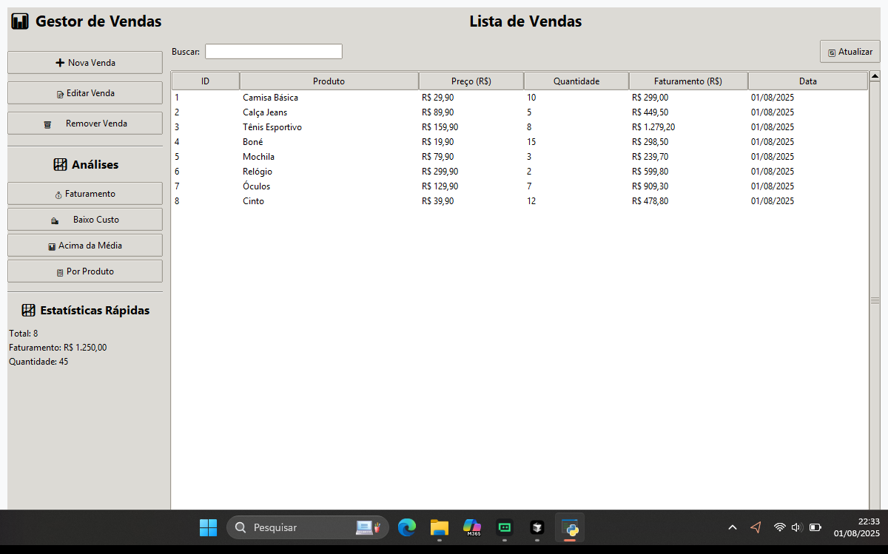

# 📊 Sistema de Gestão de Vendas - Versão Refatorada

<div align="center">



**Sistema completo de gestão de vendas desenvolvido em Python, seguindo boas práticas de programação, arquitetura MVC e interface gráfica moderna.**

[](https://python.org)
[](https://sqlalchemy.org)
[](https://docs.python.org/3/library/tkinter.html)
[](LICENSE)

</div>

---

## ✨ Características Principais

### 🏗️ **Arquitetura e Design**
- **POO (Programação Orientada a Objetos)**: Classes bem estruturadas e encapsulamento
- **MVC (Model-View-Controller)**: Separação clara de responsabilidades
- **SOLID Principles**: Código limpo e manutenível
- **Type Hints**: Tipagem estática para melhor desenvolvimento

### 💾 **Persistência de Dados**
- **SQLAlchemy ORM**: Mapeamento objeto-relacional robusto
- **SQLite**: Banco de dados embutido e confiável
- **Transações ACID**: Controle completo de transações
- **Migrations**: Sistema de migração de dados antigos

### 🎨 **Interface Gráfica Moderna**
- **Tkinter Avançado**: Interface gráfica nativa e responsiva
- **Design System**: Cores, fontes e estilos consistentes
- **UX/UI Otimizada**: Experiência do usuário moderna
- **Diálogos Personalizados**: Formulários e confirmações elegantes

### 📊 **Análises e Relatórios Avançados**
- **Análises Estatísticas**: Cálculos avançados de vendas
- **Gráficos Interativos**: Matplotlib e Seaborn
- **Relatórios HTML**: Relatórios completos e profissionais
- **Exportação de Dados**: Múltiplos formatos de saída

---

## 🚀 Tecnologias Utilizadas

### Core
- **Python 3.8+**: Linguagem principal
- **SQLAlchemy 2.0**: ORM para banco de dados
- **SQLite**: Banco de dados relacional

### Interface
- **Tkinter**: Interface gráfica nativa
- **ttk**: Widgets modernos
- **PIL/Pillow**: Manipulação de imagens

### Análise de Dados
- **Pandas**: Manipulação e análise de dados
- **Matplotlib**: Geração de gráficos
- **Seaborn**: Visualizações estatísticas

### Utilitários
- **Logging**: Sistema de logs robusto
- **Pathlib**: Manipulação de caminhos
- **Datetime**: Tratamento de datas

---

## 📁 Estrutura do Projeto

```
gestor-de-vendas-refatorado/
├── 📁 models/                 # Camada de modelo (MVC)
│   ├── __init__.py
│   ├── venda.py              # Modelo de dados Venda
│   └── database.py           # Gerenciador de banco
├── 📁 services/              # Camada de serviço (MVC)
│   ├── __init__.py
│   ├── venda_service.py      # Lógica de negócio
│   ├── analise_service.py    # Análises estatísticas
│   └── relatorio_service.py  # Geração de relatórios
├── 📁 gui/                   # Camada de visualização (MVC)
│   ├── __init__.py
│   ├── main_window.py        # Janela principal
│   └── dialogs.py            # Diálogos personalizados
├── 📁 images/                # Imagens da interface
├── 📁 data/                  # Dados do sistema
├── 📁 logs/                  # Arquivos de log
├── 📁 reports/               # Relatórios gerados
├── 📁 charts/                # Gráficos gerados
├── config.py                 # Configurações centralizadas
├── main_refatorado.py        # Arquivo principal
├── requirements.txt          # Dependências
├── test_sistema.py           # Script de teste
├── migracao_dados.py         # Migração de dados antigos
└── README.md                 # Este arquivo
```

---

## 🛠️ Instalação e Configuração

### Pré-requisitos
- Python 3.8 ou superior
- pip (gerenciador de pacotes Python)

### Passos de Instalação

1. **Clone o repositório**
   ```bash
   git clone <url-do-repositorio>
   cd gestor-de-vendas-refatorado
   ```

2. **Crie um ambiente virtual (recomendado)**
   ```bash
   python -m venv venv
   
   # Windows
   venv\Scripts\activate
   
   # Linux/Mac
   source venv/bin/activate
   ```

3. **Instale as dependências**
   ```bash
   pip install -r requirements.txt
   ```

4. **Teste o sistema**
   ```bash
   python test_sistema.py
   ```

5. **Execute o sistema**
    ```bash
   python main_refatorado.py
   ```

---

## 🎯 Funcionalidades

### 📝 **Gestão de Vendas**
- ✅ **Adicionar Venda**: Interface intuitiva para novos registros
- ✅ **Editar Venda**: Modificação de dados existentes
- ✅ **Remover Venda**: Exclusão segura com confirmação
- ✅ **Buscar Vendas**: Filtro por nome do produto
- ✅ **Listar Todas**: Visualização completa em tabela

### 📊 **Análises Estatísticas**
- ✅ **Faturamento Total**: Cálculo detalhado por produto
- ✅ **Produtos Baixo Custo**: Análise de itens abaixo do limite
- ✅ **Vendas Acima da Média**: Identificação de outliers
- ✅ **Análise por Produto**: Agrupamento e estatísticas
- ✅ **Tendências**: Análise temporal de vendas

### 📈 **Relatórios e Gráficos**
- ✅ **Relatórios HTML**: Relatórios completos e profissionais
- ✅ **Gráficos Interativos**: Visualizações com Matplotlib
- ✅ **Exportação**: Múltiplos formatos de saída
- ✅ **Dashboard**: Estatísticas em tempo real

### 🔧 **Recursos Avançados**
- ✅ **Logging Completo**: Rastreamento de operações
- ✅ **Validação de Dados**: Verificação de integridade
- ✅ **Tratamento de Erros**: Mensagens informativas
- ✅ **Configurações Flexíveis**: Arquivo de configuração
- ✅ **Dados de Exemplo**: População automática inicial

---

## 🎨 Interface do Usuário

### Design Moderno
- **Cores Profissionais**: Paleta de cores consistente
- **Tipografia Clara**: Fontes legíveis e acessíveis
- **Layout Responsivo**: Adaptação a diferentes tamanhos
- **Ícones Intuitivos**: Navegação visual clara

### Funcionalidades da Interface
- **Menu Completo**: Acesso a todas as funcionalidades
- **Barra Lateral**: Navegação rápida e estatísticas
- **Tabela Interativa**: Lista de vendas com ordenação
- **Busca em Tempo Real**: Filtro instantâneo
- **Diálogos Elegantes**: Formulários e confirmações

---

## 📊 Exemplos de Uso

### Adicionando uma Nova Venda
1. Clique em "➕ Nova Venda" na barra lateral
2. Preencha os campos: Nome, Preço, Quantidade
3. Adicione observações opcionais
4. Clique em "Salvar"

### Gerando um Relatório
1. Acesse "📄 Relatórios" no menu
2. Selecione "📊 Relatório Completo"
3. Aguarde a geração automática
4. Visualize o relatório HTML gerado

### Analisando Dados
1. Use os botões de análise na barra lateral
2. Visualize estatísticas em tempo real
3. Explore gráficos interativos
4. Exporte dados conforme necessário

---

## 🔧 Configuração

### Arquivo de Configuração (`config.py`)
```python
# Configurações do banco de dados
DATABASE_CONFIG = {
    'url': 'sqlite:///vendas.db',
    'echo': False,
}

# Configurações da interface
GUI_CONFIG = {
    'title': 'Gestor de Vendas - Sistema de Análise',
    'width': 1200,
    'height': 800,
    'theme': 'clam',
}
```

### Personalização
- **Cores**: Modifique a paleta em `config.py`
- **Tamanhos**: Ajuste dimensões da interface
- **Logging**: Configure níveis de log
- **Banco**: Altere configurações de conexão

---

## 🐛 Solução de Problemas

### Erro de Dependências
    ```bash
# Verificar dependências
python test_sistema.py

# Reinstalar se necessário
pip install --upgrade -r requirements.txt
```

### Erro de Banco de Dados
    ```bash
# Remover banco corrompido
rm vendas.db

# Executar novamente
python main_refatorado.py
```

### Interface Não Abre
    ```bash
# Verificar Tkinter
python -c "import tkinter; print('OK')"

# Em sistemas Linux, instalar tkinter
sudo apt-get install python3-tk  # Ubuntu/Debian
```

---

## 📈 Melhorias Implementadas

### Comparação com Versão Anterior

| Aspecto | Versão Original | Versão Refatorada |
|---------|----------------|-------------------|
| **Arquitetura** | Procedural | POO + MVC |
| **Persistência** | SQLite básico | SQLAlchemy ORM |
| **Interface** | Console | GUI moderna |
| **Análises** | Básicas | Avançadas |
| **Relatórios** | Texto | HTML + Gráficos |
| **Logging** | Print | Sistema completo |
| **Configuração** | Hardcoded | Centralizada |
| **Validação** | Básica | Robusta |
| **Tratamento de Erros** | Limitado | Completo |

---

## 🤝 Contribuição

### Como Contribuir
1. Fork o projeto
2. Crie uma branch para sua feature
3. Implemente suas mudanças
4. Adicione testes se necessário
5. Envie um Pull Request

### Padrões de Código
- **PEP 8**: Estilo de código Python
- **Type Hints**: Tipagem estática
- **Docstrings**: Documentação clara
- **Logging**: Rastreamento adequado

---

## 📝 Licença

Este projeto está sob a licença MIT. Veja o arquivo `LICENSE` para mais detalhes.

---

## 👥 Autores

- **Desenvolvedor Original**: [Seu Nome]
- **Refatoração**: [Seu Nome]
- **Contribuições**: [Lista de contribuidores]

---

## 📞 Suporte

- **Issues**: Use o sistema de issues do GitHub
- **Documentação**: Consulte este README
- **Logs**: Verifique arquivos em `logs/`

---

<div align="center">

**🎉 Obrigado por usar o Sistema de Gestão de Vendas Refatorado!**

</div> 